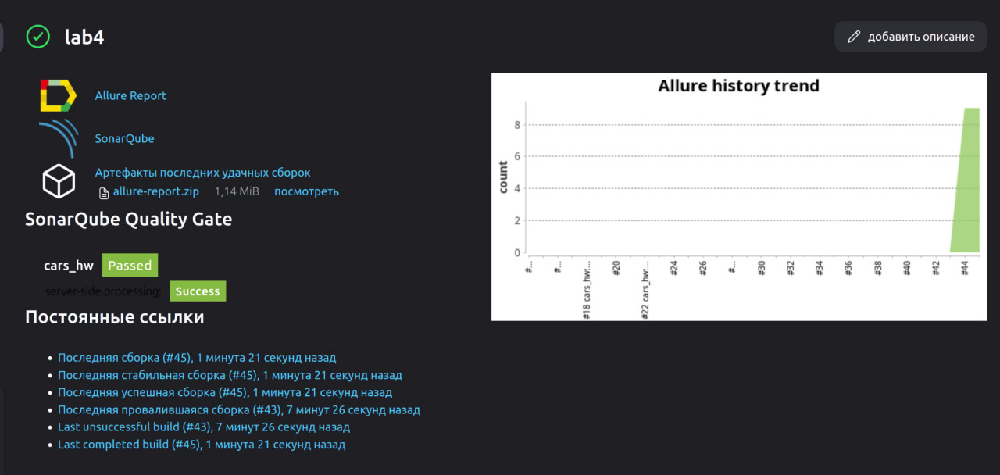
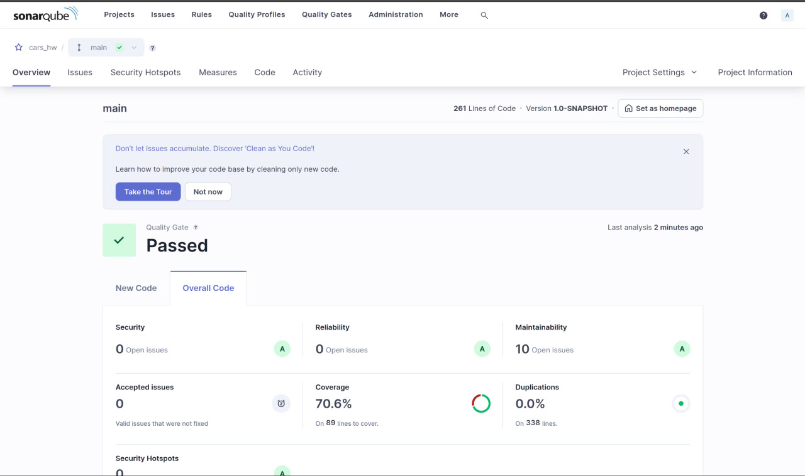
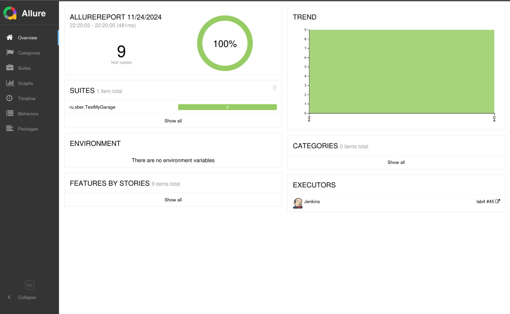
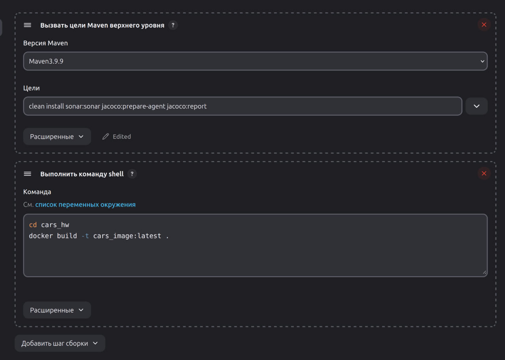

Настроил проект с дз по java в jenkins
Установил плагины для allure, sonarqube, docker, по итогу:
Главная страница в jenkins проекта:

Отчет на sonarqube:

Отчет на allure:

И настройки maven и docker в проекте для jenkins

